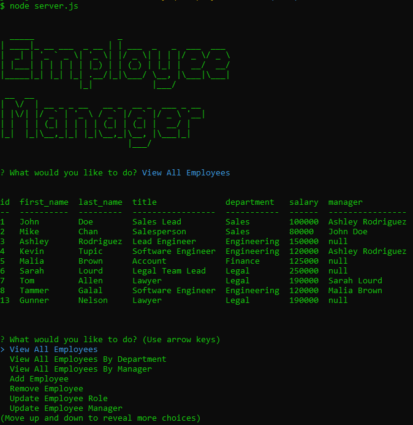

# MySQL Employee Tracker

## Description 
>*Architect and build a CMS solution with node, inquirer, and MySQL*

-----------

-----------
## Table of Contents

* [Installation and 'How to' Video](#installation)

* [Usage](#usage)

* [License](#license)

* [Contributing](#contributing)

* [Tests](#tests)

* [Resources](#resources)

* [Questions](#questions)

-----------
## Installation 
>[Click Here To Watch How To Video](https://drive.google.com/file/d/1lR9TOme-Icqt_fFthxsz8WqPw0JLinE4/view)

-----------

## Usage 
You are free to use this. I designed this for a bootcamp coding homework. It was a great way to learn about MySQL, in particular how to use some SQL within JavaScript. This is a world entirely new to me, so note this homework may be useful but it is not currently scalable and ready to use for a business database in production.

-----------

## License 
This project was created under the MIT License.

-----------

## Contributing 
Feel free to reach out if you would like to contribute on this. I am busy -- would prefer somebody who knew more than I do about code. However if there are any questions you have, my information is below.

-----------

## Tests 
To run tests, I have provided a `seed.sql` file so that you can import the database into your own system and view and play with the data.

-----------

## Resources
[How to write a multiline string](https://gist.github.com/jeromeetienne/6257420)
 
[ASCII Art Generator](https://www.ascii-art-generator.org/)
 
[SQL dump command to export MySQL DB](https://tableplus.com/blog/2019/10/sql-dump-command.html)
 
[npm dotenv for 12-Factor App Methodology](https://www.npmjs.com/package/dotenv)
 
[npm console.table for a cuter GUI](https://www.npmjs.com/package/console.table)

[npm inquirer for node-terminal User Prompts](https://www.npmjs.com/package/inquirer#examples)
 
[LIKE statements with '%' in MySQL](https://stackoverflow.com/questions/8152548/where-statement-contains-a-certain-substring/8152567)
 
[JavaScript String split() Method W3 Schools](https://www.w3schools.com/jsref/jsref_split.asp)
 
[SQL Bolt](https://sqlbolt.com/)
 
[MySQL UPDATE](https://www.mysqltutorial.org/mysql-update-data.aspx)
 
[MySQL UPDATE JOIN](https://www.mysqltutorial.org/mysql-update-join/)
 
[MySQL SELF JOIN](https://www.mysqltutorial.org/mysql-self-join/)
 
[MySQL Using More Than one Table](https://dev.mysql.com/doc/mysql-tutorial-excerpt/8.0/en/multiple-tables.html)
 
[MySQL INSERT](https://www.mysqltutorial.org/mysql-insert-statement.aspx)
 
[Join Tables A to B and B to C](https://stackoverflow.com/questions/60134380/join-a-to-c-where-table-a-and-table-c-has-only-table-b-as-relation)
 
[MySQL Tutorial for Beginners - 3 Hours YouTube!](https://www.youtube.com/watch?v=7S_tz1z_5bA)
 
[SELF JOIN Stack Overflow](https://stackoverflow.com/questions/11427300/self-join-to-get-employee-manager-name)
 
[Debugging Errors on Stack Overflow](https://stackoverflow.com/questions/40477625/nodejs-mysql-er-access-denied-error-access-denied-for-user-rootlocalhost)
 
[SQL Table Joining Syntax](https://javarevisited.blogspot.com/2012/11/how-to-join-three-tables-in-sql-query-mysql-sqlserver.html#axzz6oxG7BYAx)
 
[MySQL JOIN](https://www.mysqltutorial.org/mysql-join/)
 
[Node process object](https://nodejs.org/api/process.html#process_event_beforeexit)
 
[Managing Table Plus Connections](https://docs.tableplus.com/gui-tools/manage-connections)
 
[How to self-REFERENCE same table](https://stackoverflow.com/questions/48367314/mysql-foreign-key-to-the-same-table#:~:text=Yes%2C%20a%20foreign%20key%20can,as%20self%2Dreferencing%20foreign%20keys.)
 
[JavaScript switch case statement](https://www.javascripttutorial.net/javascript-switch-case/)
 
[Referential Constraints and Foreign Keys in MySQL](https://learnsql.com/blog/referential-constraints-foreign-keys-mysql/)
 
[MySQL Data Type Default Values](https://dev.mysql.com/doc/refman/8.0/en/data-type-defaults.html)
 
[MySQL Using Foreign Keys](https://dev.mysql.com/doc/mysql-tutorial-excerpt/5.7/en/example-foreign-keys.html)
 
[Function or Arrow?](https://www.freecodecamp.org/news/constant-confusion-why-i-still-use-javascript-function-statements-984ece0b72fd/)
 
[SQLite vs MySQL vs PostgresSQL](https://www.digitalocean.com/community/tutorials/sqlite-vs-mysql-vs-postgresql-a-comparison-of-relational-database-management-systems)
 
[SQL Injection](https://developer.mozilla.org/en-US/docs/Glossary/SQL_Injection)
 
[Relational Databases Playlist YouTube](https://www.youtube.com/watch?v=QKgNjIEp_lI&list=PL6D2AA443FA10BBBC)
 
[Primary & Foreign Keys](https://www.youtube.com/watch?v=B5r8CcTUs5Y)
 
[What is CRUD?](https://stackify.com/what-are-crud-operations/)
 
[CRUD Operations in SQL](https://www.sqlshack.com/crud-operations-in-sql-server/)
 
[Socratica Joins in SQL](https://www.youtube.com/watch?v=9yeOJ0ZMUYw)
 
-----------

## Questions 
GitHub: https://github.com/Pythonidaer

For additional information, please reach out to codefolio.work@gmail.com

 